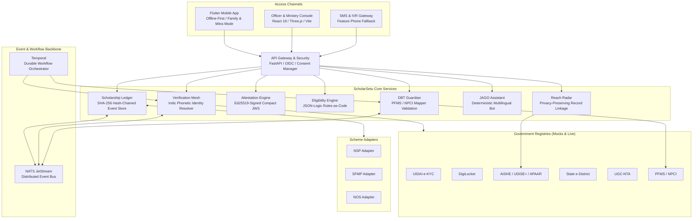

<div align="center">
  
  
  
  # ScholarSetu 🎓
  
  **Unified, frictionless scholarship platform for Scheduled Tribe students.**
  
  *Verify once, reuse everywhere, and never lose a tribal student between schemes, systems or bank accounts.*
  
  [](#)
  [](#)
  [](#)
  [](#)

</div>

<br/>

### 🚀 Live Deployments & Quick Links
- 🌐 **Officer & Ministry Web Console**: [https://console-khaki-two.vercel.app](https://console-khaki-two.vercel.app)
- 🔌 **Live Backend API & OpenAPI Docs**: [https://scholarsetu-api.onrender.com/docs](https://scholarsetu-api.onrender.com/docs)
- 📱 **Android Mobile App (APK)**: [Download APK (Google Drive)](https://drive.google.com/file/d/1hBN2RIaWfgWgg0PYulFaMoLm0Z1ax4YJ/view?usp=sharing)
- 🏗 **Comprehensive Architectural Specification (66KB)**: [docs/ARCHITECTURE.md](docs/ARCHITECTURE.md)
- 🎬 **Full Project Demo & Voiceover Script**: [docs/FULL_PROJECT_DEMO_SCRIPT.md](docs/FULL_PROJECT_DEMO_SCRIPT.md)

---

### ✨ Key Features at a Glance

* **🛡️ Scholarship Passport**: Verified demographic claims (Income, Caste, Identity) are cryptographically signed using Ed25519 keys and converted into QR codes.
* **🤖 Groq-Powered AI Assistant (JAGO)**: A blazing-fast, localized AI chatbot that helps students track applications and disbursements.
* **🔗 DigiLocker Integration**: 1-click document fetch mechanism integrated natively into the mobile experience.
* **📱 Offline-First Mobile App**: Flutter app with SQLCipher local storage and "Mitra Mode" for assisted applications.
* **📊 3D Management Console**: Unified, real-time tracking for Ministry officials built with React, Vite, and Three.js.

> **Note**: This is a working prototype. Government systems (NSP, SFMP, NOS portal, DigiLocker, UIDAI, e-District, AISHE, UDISE+, APAAR, UGC-NTA, PFMS/NPCI) are **mock services** with synthetic data. Every place where the prototype differs from the design is listed in [ARCHITECTURE.md §19 "Prototype Deviations"](docs/ARCHITECTURE.md#19-prototype-deviations).

---

## Architecture & System Design



### Monorepo Structure

```
scholarsetu/
├── adapters/          # Anti-corruption adapters for external portals (NSP, SFMP, NOS)
├── apps/
│   ├── console/       # Web Management Console (React, Vite, Three.js, Tailwind)
│   └── mobile/        # Student & Mitra Mobile App (Flutter, SQLCipher offline store)
├── contracts/         # Canonical data schemas & event contracts (JSON Schema)
├── deploy/            # Cloud deployment configurations (Google Cloud Run, Cloud SQL, VM)
├── docs/              # Comprehensive architectural specs, audits, and demo scripts
│   ├── ARCHITECTURE.md            # Complete 66KB system architectural specification
│   ├── FULL_PROJECT_DEMO_SCRIPT.md # End-to-end demo and voiceover walkthrough
│   └── LOGIC_AUDIT.md             # Formal logic audit and edge-case verification
├── infra/             # Infrastructure definitions (Docker Compose, Nginx, PostgreSQL)
├── mocks/             # High-fidelity mock microservices for 8+ government registries
├── rules/             # Machine-readable scheme eligibility rules (JSON-Logic)
├── scripts/           # Environment generation, database seeding, and smoke tests
├── services/
│   └── core/          # Core backend service (FastAPI, SQLAlchemy, pgvector, Temporal worker)
└── tests/             # Comprehensive test suite (Unit, Contract, Integration, E2E)
```

## What it does

| Part | What is real in this prototype |
|---|---|
| **Scholarship ledger** | Append-only, hash-chained event log per application in Postgres; `GET /v1/applications/{id}/verify-chain` recomputes the chain and reports the first altered event. Events go to NATS JetStream through a transactional outbox. |
| **Verification mesh** | Seven verifier plugins call the mock sources over HTTP, with the student's consent. Failures and outages never count as verified: they go to an officer review queue. Confirmed claims become Ed25519-signed attestations (compact JWS) that later applications reuse. |
| **Indic identity resolver** | Transliterates Devanagari/Bengali/Odia names, compares tokens phonetically, and requires date of birth / father's name / district to agree before it auto-verifies. It never auto-rejects; siblings and namesakes go to review. Tested on a labelled set in `tests/identity_matching_eval/`. |
| **Eligibility and pathway** | Scheme rules live only in `rules/*.json` (JSON-Logic, versioned, with sources). Missing facts give "needs …", not a silent "no". One scholarship at a time is enforced when applying. Values still to be checked against official guidelines: [docs/RULE_VALUES_TO_VERIFY.md](docs/RULE_VALUES_TO_VERIFY.md). |
| **DBT Guardian** | Checks the bank account with the mock NPCI mapper/PFMS before money is sent (Aadhaar seeding, account status, name match) and explains fixes in Hindi and English; failed payments can be retried. |
| **JAGO assistant** | Answers status and money questions from the ledger (every rupee figure comes from the payment records) and scheme questions from the official guideline text, with citations. Rule-based and deterministic, Hindi and English (§19). |
| **Reach Radar** | Privacy-preserving record linkage (salted Bloom-filter encodings plus hashed APAAR IDs) between a synthetic UDISE+ roster and scholarship records; coverage and transition rates by district and block. |
| **Workflows and nudges** | Temporal workflows watch every application's SLA and escalate institute → district → state; notifications are stored per user and polled by the app; SMS is simulated (inbound `STATUS <application id>` works from the registered phone). |
| **Officer / ministry console** | React app (`apps/console`): OTP login, review queue with the resolver's real score and explanation, decisions recorded in the ledger, applications and timelines, dashboards computed from the ledger. |
| **Student / family / Mitra app** | Flutter app (`apps/mobile`): OTP registration and login, encrypted offline store (SQLCipher), persistent outbox, delta sync, family mode, Mitra (assisted) mode with student OTP consent. |

## Quick start (from a clean clone)

Needs Docker with Compose, Python 3, and `openssl`.

```bash
python3 scripts/make_env.py --demo   # writes .env with fresh random secrets; --demo enables demo logins
make keys                            # Ed25519 attestation signing key (services/core/secrets/)
make up                              # builds and starts the whole stack in the background
make seed                            # the demo world: Sunita, Rahul, their father, officers, synthetic students
make smoke-test                      # the 8 demo scenes, checked by content; exits 1 on any failure
```

The API is at http://localhost:8000 (OpenAPI docs at `/docs`). Readiness: `curl http://localhost:8000/health/ready`.
Use `make dev` instead of `make up` for live code reload, and `make down` to stop.

Without `--demo`, logins need the SMS code, which the simulated gateway stores in the `outbound_sms`
table (with `DEMO_MODE=true` it is also shown at http://localhost:8000/v1/dev/sms-outbox).

### Signing in

| Who | Where | How |
|---|---|---|
| Students | App | **Continue with DigiLocker**. A new student signs up in the same step: name, date of birth and gender come from DigiLocker. |
| Officers and the Ministry | Console | A 6-digit code emailed from `contact@yugnext-ai.com` (Microsoft 365). Officers are enrolled by the Ministry on the **Officers** page. |

Every sign-in page has a **Demo mode** switch. With it on (and `DEMO_MODE=true` on the server) the seeded demo
accounts below sign in with the code `123456`. The server accepts that code **only** for these demo accounts and
only from the demo switch; real accounts always need DigiLocker or the emailed code, and the Super Admin is a real
account.

| Demo account | Where | Signs in as |
|---|---|---|
| Sunita Hansda | App | Student with a Post-Matric 2026-27 application at the district stage |
| Babulal Hansda | App | Her father (family view) |
| Principal, Dumka Government College | Console | Institute officer, Dumka |
| District Welfare Officer, Dumka | Console | District officer |
| Tribal Welfare Department, Jharkhand | Console | State officer |
| MoTA Scholarship Division | Console | Ministry |

`python scripts/seed_demo.py --reset` restores exactly these accounts (it deletes all people and records; take a
backup first). The test suite uses a richer world in `tests/demo_world.py`.

### Console (officers and ministry)

`make up` also builds the production console (unprivileged nginx, strict CSP) at http://localhost:8080.
For development with hot reload:

```bash
cd apps/console
cp .env.example .env        # VITE_API_URL=http://localhost:8000
npm ci && npm run dev       # http://localhost:5173
```

### Mobile app (students, guardians, Mitra)

```bash
cd apps/mobile
flutter pub get
flutter run                                   # Android emulator; reaches the API at 10.0.2.2:8000
flutter run --dart-define=API_URL=http://<your-ip>:8000   # a phone on the same network
flutter build apk --debug
```

See [apps/mobile/README.md](apps/mobile/README.md).

**Release signing (Play Store).** Release builds use `apps/mobile/android/key.properties` when it exists (it is
git-ignored); without it they are signed with the debug key and Gradle prints a warning. Create an upload key once
and keep the keystore and passwords safe (losing them means a new app listing):

```bash
keytool -genkey -v -keystore ~/scholarsetu-upload.jks -keyalg RSA -keysize 2048 -validity 10000 -alias upload
cat > apps/mobile/android/key.properties <<'PROPS'
storeFile=/Users/<you>/scholarsetu-upload.jks
storePassword=<password>
keyAlias=upload
keyPassword=<password>
PROPS
```

## Design

One visual language across the web console and the mobile app: deep ink surfaces, a saffron accent,
teal for "verified", and the Inter typeface (bundled, never fetched from a CDN).

- **3D in the console** (`apps/console/src/three/`): react-three-fiber scenes with physically based
  materials (glass, brushed metal) lit by procedural studio light panels, so no HDRI or font is
  downloaded at runtime. The login hero is a glass *setu* (bridge) that students cross; the dashboard
  and coverage pages show real API figures as 3D bars (coverage is scaled out of 100%). three.js loads
  only on those views; without WebGL, or with reduced motion, the pages fall back to 2D charts and tables.
- **3D in the mobile app**: Flutter cannot run three.js, so the same scenes are rendered to images
  (`apps/console/scripts/render-assets.mjs` → `apps/mobile/assets/images/`) and used in the app's
  headers. The app's stage tracker, cards and animations are native Flutter.

## Services and ports

| Service | Host port | Notes |
|---|---|---|
| Core API (FastAPI) | 8000 | `/docs`, `/health`, `/health/ready` |
| Mock government services | 8100 | paths below |
| Postgres + pgvector | 5434 | |
| NATS JetStream | 4223 (monitoring 8223) | stream `SCHOLARSETU` |
| Object storage (SeaweedFS, S3 API) | 9002 | wallet documents |
| Temporal dev server | 7233 (web UI 8233) | SLA and DBT-retry workflows; the `worker` container runs them |
| Redis | 6380 | provisioned; not used by the API yet (§19) |
| Console (production build) | 8080 | nginx container in compose |
| Console (Vite dev server) | 5173 | `npm run dev` |

### Mock government services (`http://localhost:8100`)

| Path | Stands in for |
|---|---|
| `/uidai` | UIDAI e-KYC (demographic match by Aadhaar reference token) |
| `/digilocker` | The test DigiLocker: the partner API shape (`/public/oauth2/1/authorize`, `/token`, `/2/files/issued`, `/1/file/{uri}`, OAuth 2.0 + PKCE). Sign in with a demo student's mobile number and the code shown on the page. Its documents are stamped TEST DOCUMENT, stored as "DigiLocker (test)", never issuer-signed, and count as proof only in demo mode. |
| `/edistrict` | e-District (income, domicile, caste certificates) |
| `/aishe`, `/udise`, `/apaar` | Higher-education and school enrolment, APAAR IDs; `/udise` also publishes PPRL encodings |
| `/nta` | UGC-NET / JRF results |
| `/pfms` (NPCI mapper at `/pfms/npci/mapper/{ref}`) | PFMS DBT payments and the NPCI Aadhaar mapper |
| `/nsp`, `/sfmp`, `/nos` | The three scholarship portals (application status feeds) |

Unknown records return 404; there is no language-AI (Bhashini) mock.

"Get from DigiLocker" in the app runs the real partner flow against the test DigiLocker. Going live changes only
configuration: `DIGILOCKER_MODE=production`, `DIGILOCKER_API_URL`, `DIGILOCKER_AUTHORIZE_URL`, `DIGILOCKER_CLIENT_ID`
and the client secret in Secret Manager (ARCHITECTURE.md §19, row 44).

## Deploying to Google Cloud

`deploy/gcp/deploy.sh` sets up one environment (`ENV=demo` or `ENV=prod`) in project `trisphere-4b121`.
Each step is idempotent:

```bash
ENV=demo deploy/gcp/deploy.sh all       # or one step: apis sql bucket secrets images vm migrate api monitor
```

| Piece | What runs |
|---|---|
| Cloud Run `scholarsetu-api` | The API; request-driven, scales to zero; secrets from Secret Manager; Cloud SQL through the built-in connector |
| Cloud SQL `scholarsetu-db` | Postgres 16 + pgvector, database `scholarsetu_<env>`, daily backups and point-in-time recovery |
| Cloud Storage | Wallet documents (bucket `<project>-scholarsetu-<env>-wallet`, private) |
| VM `scholarsetu-backend-<env>` | No public IP. NATS JetStream, Temporal, the worker (SLA and payment-retry workflows, outbox publishing, notifications, portal polling), the mock government services, the Cloud SQL proxy. Container logs go to Cloud Logging |
| Secret Manager `scholarsetu-<env>-*` | Generated by the script; never printed or stored locally. Add `scholarsetu-<env>-gemini-key` to enable AI phrasing |
| Monitoring | Uptime check on `/health/ready`; email alert if it fails for 5 minutes or on server errors |

Migrations run as the Cloud Run job `scholarsetu-migrate-<env>` (the demo job also loads the demo data).
To release a new version: commit, then `ENV=demo deploy/gcp/deploy.sh images vm migrate api`.

The **demo** environment is live (`DEMO_MODE=true`). A **production** environment (`ENV=prod`, demo mode off) is
the same command, but nobody could sign in to it until a real SMS gateway sends the login codes.

## Tests

```bash
pip install -r services/core/requirements-dev.txt
make up          # tests use the compose Postgres on localhost:5434 (database scholarsetu_test)
pytest           # unit, contract, integration; e2e runs when SMOKE_BASE_URL is set
ruff check .
cd apps/console && npm run lint && npm run build
cd apps/mobile && flutter analyze && flutter test
```

- `tests/unit` — identity resolver, hash chain, rule files, portal state maps, PPRL, config safety
- `tests/contract` — every published event matches `contracts/events.schema.json`; every route in ARCHITECTURE.md §8 exists
- `tests/integration` — one file per fix phase, plus `test_judge_probes.py`
- `tests/identity_matching_eval` — labelled name-variant pairs
- `tests/e2e` — the smoke test (`scripts/demo_smoke_test.py`) against a running stack

CI (`.github/workflows/ci.yml`) runs ruff, pytest against pgvector, the console lint and build, Flutter
analyze and tests, and the smoke test against the compose stack.

## Documentation

- [docs/ARCHITECTURE.md](docs/ARCHITECTURE.md) — design, API, data model; §19 lists every prototype deviation
- [docs/demo-script.md](docs/demo-script.md) — the 7-minute judge demo, scene by scene
- [docs/PITCH_AND_DEFENSE.md](docs/PITCH_AND_DEFENSE.md) — pitch and answers to likely questions
- [docs/VALIDATION_REPORT.md](docs/VALIDATION_REPORT.md) — the audit of the original prototype and the status of each finding
- [docs/RULE_VALUES_TO_VERIFY.md](docs/RULE_VALUES_TO_VERIFY.md) — scheme values to confirm against official guidelines

## Team ACE — SIH 2026
