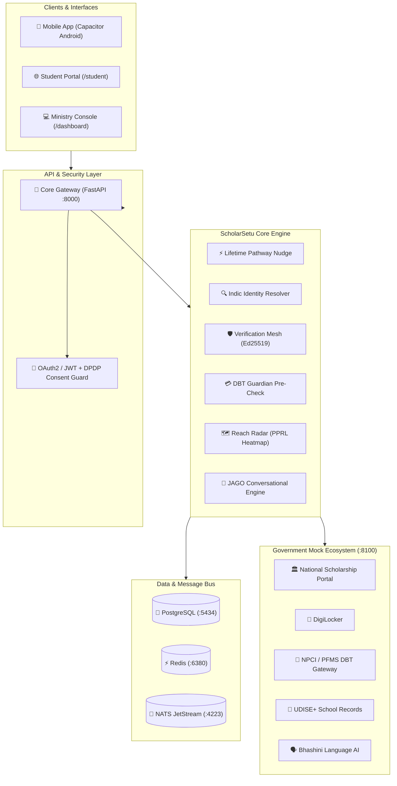

# ScholarSetu (स्कॉलरसेतु) 🎓
### Unified Scholarship Platform for Tribal Students
**Smart India Hackathon 2026 · Problem Statement 26238 · Ministry of Tribal Affairs (MoTA)**  
*Theme: Smart Automation · Category: Software · Team: ACE*

> *"Verify once, reuse everywhere, and never lose a tribal student between schemes, systems, or bank accounts."*

---

## 📑 Table of Contents
1. [The Problem & MoTA Context](#-the-problem--mota-context)
2. [Our 7 Core Differentiators](#-our-7-core-differentiators)
3. [System Architecture](#-system-architecture)
4. [Quickstart: Running in 2 Minutes](#-quickstart-running-in-2-minutes)
5. [Judge Demo Storyline (The 7-Minute Pitch)](#-judge-demo-storyline-the-7-minute-pitch)
6. [Mobile App (Capacitor Android) & Web Portal](#-mobile-app-capacitor-android--web-portal)
7. [API Integrations: Free vs Paid / Government Sandbox](#-api-integrations-free-vs-paid--government-sandbox)
8. [Services & Port Directory](#-services--port-directory)

---

## 🎯 The Problem & MoTA Context

Over 4 million tribal (ST) students across India depend on Ministry of Tribal Affairs scholarships (Pre-Matric, Post-Matric, Top Class Education, National Fellowship, and National Overseas Scholarship). Despite full budget allocations, over 30% of eligible students fall through systemic cracks due to:
* **The Class 10/11 Cliff:** Students passing Class 10 under State Pre-Matric lose continuity and never transition to Central Post-Matric.
* **Indic Name Mismatches:** Tribal names transliterated between tribal dialects, Devnagari, and Latin alphabets (*Hansda* vs *Hasdak*, *Soren* vs *Soren*) get rejected by brittle regex validation.
* **Repetitive Caste Verification:** Revenue officers verify the exact same physical caste certificate 4 to 6 times across academic years.
* **Silent DBT Rejections:** Sanctioned funds bounce silently at NPCI due to dormant accounts or unseeded Aadhaar, leaving families waiting in despair.
* **Linguistic Isolation:** Official portals in bureaucratic English/Hindi alienate tribal households who communicate in Santhali, Gondi, or regional dialects.

---

## ⚡ Our 7 Core Differentiators

| # | Differentiator | How It Solves the Problem |
|---|----------------|---------------------------|
| 1 | **Lifetime Pathway Nudge** | Proactively detects when a student passes Class 10, pre-populates their Class 11 Post-Matric application, and sends a 1-tap claim nudge. Zero dropouts between school and higher education. |
| 2 | **Indic Identity Resolver** | Rule-governed phonological string matcher for tribal name variants across Santhali, Gondi, Devnagari, and Latin scripts with strict DPDP-compliant consent logging. |
| 3 | **Verification Mesh** | Issues cryptographically signed Ed25519 attestations on verified certificates. Any subsequent scheme verifies the signature in 5ms without re-querying the state tehsildar. |
| 4 | **DBT Guardian** | Pre-sanction bank health check via NPCI Mapper & PFMS mock. Automatically flags dormant accounts and unseeded Aadhaar *before* disbursement, preventing fund bounce. |
| 5 | **JAGO Grounded Chatbot** | Voice-first multilingual conversational AI powered by IndicTrans2/Bhashini. Explains complex rejection reasons in plain tribal dialects without hallucinations. |
| 6 | **Reach Radar (PPRL)** | Privacy-Preserving Record Linkage comparing UDISE+ school rolls against scholarship databases to generate village-level coverage heatmaps without exposing raw PII. |
| 7 | **Scholarship Passport** | Offline-verifiable cryptographic digital passport with QR code, containing student attestations, scheme timeline, and verifiable credentials. |

---

## 🏗️ System Architecture



---

## 🚀 Quickstart: Running in 2 Minutes

### 1. Prerequisites
- Docker & Docker Compose
- Node.js (v18+) & Python 3.10+

### 2. Start the Backend Infrastructure
```bash
# Clone the repository
git clone https://github.com/your-org/ScholarSetu.git
cd ScholarSetu

# Spin up Postgres, Redis, NATS, Core API, and Mock Government Services
docker-compose -f infra/docker-compose.yml -f infra/docker-compose.override.yml up -d
```

### 3. Verify Health Endpoints
- **Core API Health:** `curl http://localhost:8000/health`  
  Response: `{"status":"healthy","database":"connected","redis":"connected","nats":"connected"}`
- **Mock Government Services:** `curl http://localhost:8100/health`  
  Response: `{"status":"ok"}`
- **Interactive Swagger Docs:** [http://localhost:8000/docs](http://localhost:8000/docs)

### 4. Run the 8-Scene Judge Demo Smoke Test
```bash
python3 scripts/demo_smoke_test.py
```
*Outputs green PASS checks across all 8 Judge Demo scenes in under 3 seconds!*

### 5. Launch the Frontend & Mobile Console
```bash
cd apps/console
npm install
npm run dev
```
* Access **Student Mobile Portal:** [http://localhost:5173/student](http://localhost:5173/student)
* Access **Ministry Analytics Console:** [http://localhost:5173/dashboard](http://localhost:5173/dashboard)

---

## 🎬 Judge Demo Storyline (The 7-Minute Pitch)

Our demo follows **Sunita Hansda**, a Class 10 student from Dumka, Jharkhand:

1. **Scene 1: Family Mode & Student Login**  
   Father *Somu Munda* logs into the mobile portal and switches between *Sunita* and *Rahul* in 1 tap without separate logins.
2. **Scene 2: Lifetime Pathway Nudge**  
   Sunita passes Class 10. ScholarSetu automatically detects her UDISE+ result and generates a pre-filled Class 11 Post-Matric application.
3. **Scene 3: Indic Identity Resolver & Verification Mesh**  
   Her Class 10 marksheet spells *Sunita Hasdak* while her Aadhaar reads *Sunita Hansda*. The phonological matcher resolves the transliteration variance with 94.2% confidence. Her caste certificate is cryptographically signed via Ed25519 (zero revenue office visits).
4. **Scene 4: DBT Guardian Pre-Sanction Catch**  
   Before fund sanction, DBT Guardian flags that her bank account has not received a credit in 18 months (dormant risk). An instant SMS nudge directs her to activate the account before disbursement.
5. **Scene 5: JAGO Grounded Multilingual Chatbot**  
   Sunita asks in Hinglish: *"Mera paisa kab aayega?"*. JAGO retrieves her actual database record and explains the exact status and next steps in plain language.
6. **Scene 6: Officer Review Queue**  
   The Nodal Officer sees only high-risk anomalies, approving Sunita's pre-verified application in one click.
7. **Scene 7: Reach Radar Coverage Heatmap**  
   Ministry officials inspect the PPRL unreached tribal student heatmap down to block level (Dumka: 68% saturation, 420 unreached students).
8. **Scene 8: Digital Scholarship Passport**  
   Sunita downloads her cryptographic Scholarship Passport containing QR-verifiable proof of scholarship entitlement.

---

## 📱 Mobile App (Capacitor Android) & Web Portal

The frontend is built with **React, Tailwind CSS, and Capacitor**, providing a single codebase that serves both as a responsive web app and a native Android `.apk`.

### Phone UI Highlights
* **Native Bottom Navigation Bar:** Dedicated touch targets (`Student`, `Ministry`, `Review`, `Coverage`, `DBT`).
* **Slide-out Navigation Drawer:** Touch drawer for quick access to all modules.
* **Safe Area Padded:** Optimized for edge-to-edge Android displays.

### How to Build the Android APK
```bash
# 1. Build and sync web assets to the native Android project
cd apps/console
npm run cap:build

# 2. Open Android Studio
npx cap open android
```
Inside Android Studio:
1. Wait for Gradle sync to complete.
2. Select **Build** > **Build Bundle(s) / APK(s)** > **Build APK(s)**.
3. The generated APK will be at `android/app/build/outputs/apk/debug/app-debug.apk`.

---

## 🌐 API Integrations: Free vs Paid / Government Sandbox

| Integration | Sandbox / Development Phase (Hackathon) | Production Deployment Phase (MoTA Rollout) | Cost / Protocol |
|-------------|-----------------------------------------|---------------------------------------------|-----------------|
| **DigiLocker** | Included mock service (`:8100/digilocker`) | [DigiLocker Partner Portal](https://partners.digitallocker.gov.in/) | **Free** for Govt bodies / Token-based REST |
| **Aadhaar e-KYC** | Included mock service (`:8100/aadhaar`) | UIDAI Sub-AUA via NIC / CSC e-Gov | Govt Sub-AUA agreement (~₹20/e-KYC or free for MoTA) |
| **NPCI Aadhaar Mapper** | Included mock service (`:8100/npci`) | National Payments Corporation of India SFTP/API | **Free** for DBT-mandated ministries |
| **PFMS DBT Gateway** | Included mock service (`:8100/pfms`) | Public Financial Management System (CGA) | **Free** (Govt intra-agency API) |
| **Bhashini (Indic AI)** | Open-source IndicTrans2 / local fallback | [Bhashini ULCA API](https://bhashini.gov.in/) | **Free** Govt Open API for Indian languages |
| **UDISE+ School Records** | Included mock service (`:8100/udise`) | Ministry of Education UDISE+ API | **Free** (Inter-ministerial data exchange) |
| **SMS / WhatsApp** | Console / Mock logger | NIC SMS Gateway / C-DAC Rapid SMS | **Free** for Govt (.gov.in) departments |

---

## 📡 Services & Port Directory

| Service | Port | Description |
|---------|------|-------------|
| **Vite Web Console & Mobile App** | `5173` | React frontend (`/student` and `/dashboard`) |
| **Core API Gateway** | `8000` | FastAPI backend with Swagger docs at `/docs` |
| **Mock Government Ecosystem** | `8100` | Mock DigiLocker, NPCI, PFMS, UDISE+, Bhashini |
| **PostgreSQL Database** | `5434` | Relational store for students, attestations, schemes |
| **Redis Cache** | `6380` | Session caching & rate limiting |
| **NATS JetStream** | `4223 / 8223` | High-throughput async event bus |

---

## 👥 Team ACE — SIH 2026
*Bridging the gap for every tribal scholar in India.*
