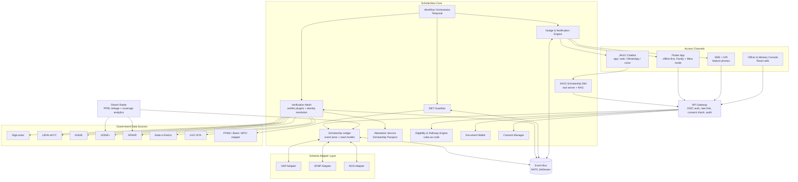
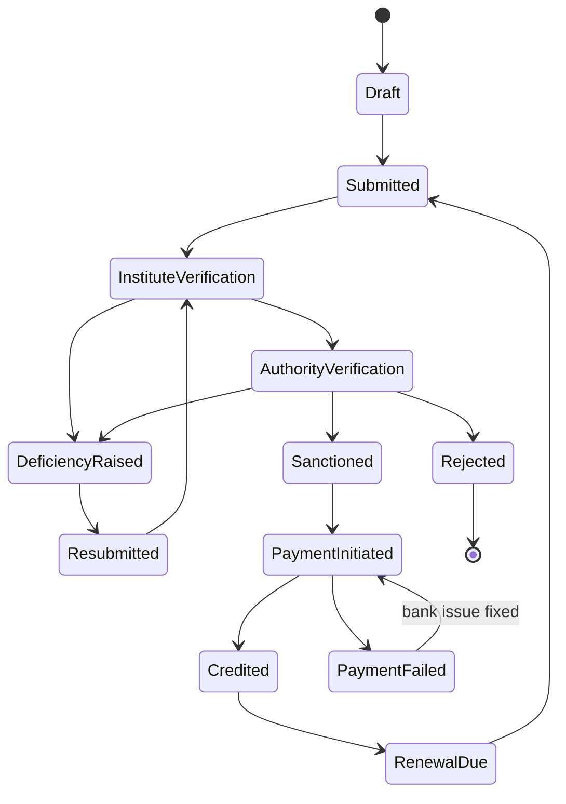
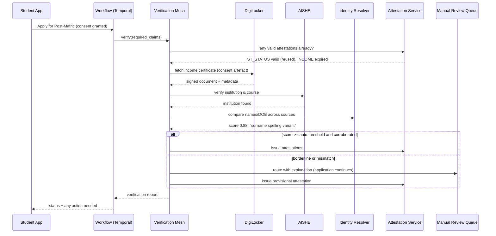
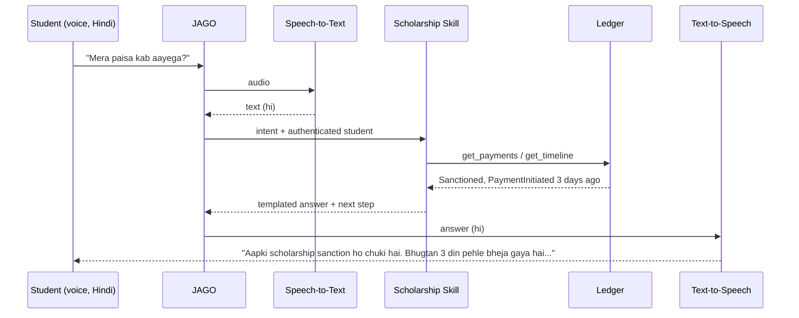
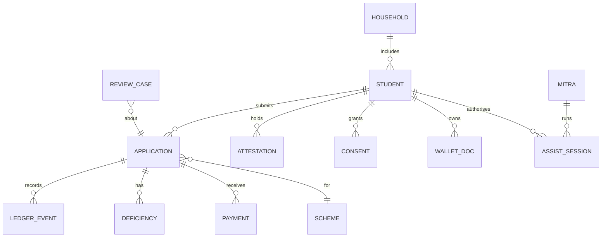

# ScholarSetu — Unified Scholarship Platform for Tribal Students

**SIH 2026 · Problem Statement 26238 · Ministry of Tribal Affairs (MoTA)**
**Theme:** Smart Automation · **Category:** Software · **Team:** ACE

> *Working name "ScholarSetu" (a bridge between the student and every scholarship system). Rename freely.*

**One-line pitch:** *Verify once, reuse everywhere, and never lose a tribal student between schemes, systems, or bank accounts.*

---

## Table of Contents

1. [Problem Understanding](#1-problem-understanding)
2. [Root-Cause Analysis: What Actually Breaks](#2-root-cause-analysis-what-actually-breaks)
3. [What Most Teams Will Build (and Why It Falls Short)](#3-what-most-teams-will-build-and-why-it-falls-short)
4. [Our Approach: Seven Differentiators](#4-our-approach-seven-differentiators)
5. [High-Level Architecture](#5-high-level-architecture)
6. [Component Deep Dives](#6-component-deep-dives)
7. [Data Model](#7-data-model)
8. [API Design](#8-api-design)
9. [Security, Privacy and DPDP Compliance](#9-security-privacy-and-dpdp-compliance)
10. [Scalability and Reliability](#10-scalability-and-reliability)
11. [Tech Stack](#11-tech-stack)
12. [Repository Structure](#12-repository-structure)
13. [PS Traceability Matrix](#13-ps-traceability-matrix)
14. [Judge Demo Storyline](#14-judge-demo-storyline)
15. [Build Roadmap](#15-build-roadmap)
16. [Risks and Mitigations](#16-risks-and-mitigations)
17. [Impact Metrics](#17-impact-metrics)
18. [Glossary](#18-glossary)
19. [Prototype Deviations](#19-prototype-deviations)

---

## 1. Problem Understanding

### 1.1 The five schemes

| Scheme | Who it serves | Typical verification needs |
|---|---|---|
| Pre-Matric | ST students in classes 9–10 | Identity, ST certificate, income, school enrolment (UDISE+) |
| Post-Matric | ST students after class 10 (Class 11 → PG) | Identity, ST certificate, income, institution & course (AISHE), previous marks |
| Top Class Education | ST students in notified premier institutions | Identity, ST certificate, income, admission in a notified institution |
| National Fellowship (NFST) | ST M.Phil/PhD scholars | Identity, ST certificate, NET/JRF qualification (UGC-NTA), university registration |
| National Overseas Scholarship (NOS) | ST students going abroad for Master's/PhD/Post-doc | Identity, ST certificate, income, foreign admission, academic record |

These are spread across **three disconnected systems**: the National Scholarship Portal (NSP), the Scholarship Fellowship Management Portal (SFMP, run with Canara Bank), and the standalone NOS Portal. The exact scheme-to-portal mapping is kept as configuration in our adapter layer, so it can follow the Ministry's current setup (see tribal.nic.in/ScholarshiP.aspx).

### 1.2 What the PS asks for

1. **Scholarship Module:** one dashboard for all five schemes covering submission → verification → sanction → disbursement; a document wallet with DigiLocker; reuse of earlier data; one view of payments, DBT status, pending actions and deficiencies.
2. **JAGO Chatbot integration:** student-specific, multilingual answers on eligibility, status, documents, deficiencies and disbursement, plus milestone alerts.
3. **Unified Verification & Integration Layer:** connect scholarship systems and government sources (DigiLocker, UIDAI, AISHE, UDISE+, APAAR, State e-District, UGC-NTA) for automated or semi-automated verification, with mismatches routed to manual review **instead of blocking**.
4. **Coverage-gap discovery (implicit but important):** find ST students who are enrolled (UDISE+/APAAR/OTR) but not availing any scholarship, so the Ministry can reach them.

### 1.3 Hard constraints hidden in the PS

- **One scholarship at a time:** a student can hold only one scheme at a time, so the system must know a student's *current* holdings across all three portals before allowing a new application.
- **Families span schemes:** one household may have a child in Pre-Matric and another in Post-Matric, so a family-level view is required.
- **We don't own the source systems.** NSP, SFMP and NOS will keep running. We must *integrate, not replace*.

---

## 2. Root-Cause Analysis: What Actually Breaks

The PS describes symptoms. These are the underlying causes we design against:

| # | Root cause | Real-world effect | Our answer |
|---|---|---|---|
| R1 | Status lives in 3 systems with 3 different state vocabularies | Nobody can answer "where is my application?" in one place | Canonical lifecycle + Scheme Adapters (§6.2) |
| R2 | Every scheme and every year re-verifies the same facts | Repeated uploads, repeated delays | Reusable signed **Verification Attestations** (§6.4) |
| R3 | Names are spelled differently across Aadhaar, school, caste and bank records (transliteration, initials, surname variants) | Legitimate applications flagged or rejected for "mismatch" | **Indic-aware identity matching** with explainable scores (§6.4.3) |
| R4 | DBT fails *after* sanction because of bank/Aadhaar seeding problems | Money sanctioned but never received; student doesn't know why | **DBT Guardian** pre-sanction checks (§6.6) |
| R5 | Students drop out of the system at transitions (Class 10 → 11, UG → PG, PG → PhD) | A student eligible for the next scheme never applies | **Lifetime Scholarship Pathway** with auto-nudges (§6.5) |
| R6 | Low connectivity, shared phones, low digital literacy, many languages | App-only solutions exclude the very users they target | Offline-first app, Family mode, **Mitra (assisted) mode**, voice, SMS/IVR (§6.1) |
| R7 | Unreached students are invisible because data sits in separate silos and pooling PII is risky | Ministry cannot target outreach | **Reach Radar** with privacy-preserving record linkage (§6.8) |

---

## 3. What Most Teams Will Build (and Why It Falls Short)

A typical submission will be: a React Native/Flutter app with a dashboard, a mocked DigiLocker login, a status list per scheme, an LLM chatbot wrapper, OCR on uploaded documents, and maybe a Firebase backend.

| Typical approach | Why it's weak | What we do instead |
|---|---|---|
| Build "a new portal" | Ministry won't replace NSP/SFMP/NOS | Anti-corruption **adapter layer** on top of existing systems |
| OCR every uploaded document | OCR is the *fallback*, not verification; it's forgeable | **Source-of-truth API verification first**, OCR only when no API exists |
| Pass/fail verification | Blocks students on small mismatches | **Confidence scoring + explainable exceptions + manual queue** |
| Generic LLM chatbot | Hallucinates amounts and dates; unsafe for money | **Tool-grounded JAGO skill**: numbers only come from the ledger |
| Status shown as a single label | No history, no accountability | **Event-sourced ledger** with a full timeline and SLA timers |
| "Find unreached students" by merging databases | Privacy risk; not DPDP-friendly | **Bloom-filter PPRL**: match without sharing raw PII |
| Assumes each student owns a smartphone and has good data | Not true for many tribal households | Offline-first, shared-device profiles, assisted mode, SMS/IVR |

*No one can guarantee what other teams will think of, but the combination below — especially attestations, Indic identity matching, DBT Guardian, PPRL and Mitra mode — is rare and each piece maps to a real, documented pain point.*

---

## 4. Our Approach: Seven Differentiators

### D1. Scholarship Passport (Verify Once, Reuse Everywhere)
Every successful verification produces a **digitally signed Verification Attestation** (e.g., "ST status verified via DigiLocker on date X, valid for lifetime"; "Income verified via e-District, valid till 31 March"). Attestations are reused across all five schemes and across renewal years until they expire. A student's collection of attestations is their **Scholarship Passport**.

### D2. Canonical Lifecycle Ledger
Status from NSP, SFMP and NOS is translated into **one canonical state machine** and stored as an **append-only event log**. The student sees a single timeline; the Ministry gets SLA analytics ("applications stuck at district verification > 21 days").

### D3. Verification Mesh with Indic-Aware Identity Resolution
A plug-in verification layer where each source (DigiLocker, UIDAI, AISHE, UDISE+, APAAR, e-District, UGC-NTA) is a **verifier plugin**. Results are combined into a confidence score. A dedicated **transliteration-aware name matcher** handles tribal and regional name variations, and every exception comes with a human-readable reason for the reviewing officer.

### D4. Lifetime Scholarship Pathway
Schemes are treated as a **ladder**, not five separate forms: Pre-Matric → Post-Matric → Top Class → NFST → NOS. The Eligibility Engine (rules-as-code) knows the student's current holding, enforces the one-scheme rule, and **proactively nudges** at transition points with pre-filled applications.

### D5. DBT Guardian
Before sanction, check that the payment will actually land: Aadhaar–bank seeding status, account active, name on bank account vs Aadhaar. After a failed DBT, translate failure codes into **plain-language fix-it steps**.

### D6. Inclusive Access by Design
Offline-first mobile app, **Family mode** (one phone, many children, one parent view), **Mitra mode** (consent-based assisted access for Ashram school teachers, hostel wardens, CSC operators), voice-first JAGO, and SMS/IVR fallback for feature phones.

### D7. Reach Radar (Privacy-Preserving Coverage Gaps)
Link UDISE+/APAAR/OTR enrolment data with scholarship registrations using **privacy-preserving record linkage (PPRL)** so no raw PII is pooled. Output: district/block-level coverage heatmaps and outreach lists sent only to the student's own institution.

---

## 5. High-Level Architecture

### 5.1 Architecture style

- **Modular monolith for the prototype, microservice-ready boundaries for production.** Each module owns its tables and talks to others only through events or internal APIs, so any module can later be split out without rewriting.
- **Event-driven core** (NATS JetStream) with **CQRS read models** for fast dashboards.
- **Durable workflows** (Temporal) for long-running processes: verification, deficiency resolution, SLA timers, DBT retries.
- **Anti-corruption layer** in front of every external system.

### 5.2 System diagram



### 5.3 Request flow in one sentence

A student action hits the gateway → consent is checked → the relevant module acts → it emits an event → the ledger, notifications and read models update asynchronously → the app syncs the new state (or receives an SMS if offline).

---

## 6. Component Deep Dives

### 6.1 Mobile App (Flutter, offline-first)

**Why Flutter:** single codebase, strong performance on low-end Android (2–3 GB RAM phones), good Indic font rendering, small APK when tree-shaken.

**Offline-first design**
- Local encrypted database (Drift + SQLCipher) holds the student's profile, applications, timeline and wallet metadata.
- **Outbox pattern:** actions taken offline (uploads, form edits, deficiency responses) are queued with idempotency keys and synced when connectivity returns.
- Delta sync: the server returns only events since the device's last `cursor`, keeping data usage tiny.
- Documents are compressed on-device (image downscaling, PDF compression) before upload.

**Screens**
1. **Home dashboard:** one card per application with the canonical status, next action, and money received so far.
2. **Timeline:** every event (submitted, verified by institute, deficiency raised, sanctioned, DBT credited) with date and actor.
3. **Pending actions:** a to-do list generated from deficiencies and expiring attestations.
4. **Scholarship Passport / Wallet:** DigiLocker documents + attestations with validity badges.
5. **Pathway:** "You are here" on the scheme ladder with the next eligible scheme.
6. **Money view:** sanctioned vs credited, per instalment, DBT status, bank health.
7. **JAGO:** chat + push-to-talk voice.

**Family mode**
- One device, multiple student profiles, each protected by its own PIN.
- A **guardian view** aggregates all children's applications and payments (read-only unless the student delegates).

**Mitra (assisted) mode**
- A registered helper (Ashram school teacher, hostel warden, CSC operator, NGO volunteer) can act *on behalf of* a student.
- Every session requires the student's **OTP consent**, is time-boxed (e.g., 30 minutes), scope-limited (e.g., "upload documents only"), and fully audit-logged.
- Solves the real situation where one teacher helps 40 hostel students apply.

**Accessibility**
- Icon-first navigation, large touch targets, audio playback of every status message.
- UI languages: Hindi, English and major regional languages; tribal-language support through voice (§6.7) and pictorial cues where text support is limited.

**Feature-phone fallback (SMS/IVR)**
- `STATUS <App-ID>` by SMS returns the canonical status and next action.
- Missed-call IVR reads out status in the chosen language.
- Critical alerts (deficiency raised, payment credited, payment failed) always go by SMS as well as push.

---

### 6.2 Scheme Adapter Layer (anti-corruption layer)

Each external scholarship system gets an adapter that:
1. Pulls or receives status updates (API, webhook, or scheduled batch file, whichever the source supports).
2. **Translates** source-specific states into our canonical lifecycle.
3. Emits canonical events to the bus.
4. Pushes student-side actions (e.g., deficiency responses) back to the source where write APIs exist.

Adding a sixth scheme or a state-level portal means writing one new adapter; nothing else changes.

#### 6.2.1 Canonical lifecycle



#### 6.2.2 State mapping (configuration, not code)

```yaml
# adapters/nsp/state_map.yaml  (illustrative; actual source codes to be confirmed)
source: NSP
mappings:
  "Application Submitted":            Submitted
  "Pending at Institute":             InstituteVerification
  "Defective - Returned to Student":  DeficiencyRaised
  "Pending at District/State":        AuthorityVerification
  "Approved":                         Sanctioned
  "Sent to PFMS":                     PaymentInitiated
  "Payment Success":                  Credited
  "Payment Failed":                   PaymentFailed
  "Rejected":                         Rejected
unknown_state_policy: park_and_alert   # never silently drop an unknown status
```

**Prototype note:** real NSP/SFMP/NOS APIs require Ministry MoUs. We build **contract-accurate mock services** (OpenAPI-defined, seeded with synthetic data) so swapping in real endpoints later is configuration only.

---

### 6.3 Scholarship Ledger (event sourcing + CQRS)

**Why event sourcing:** scholarship status is inherently a *history* ("what happened, when, by whom"). An append-only log gives the student a trustworthy timeline, gives auditors a tamper-evident trail, and lets us rebuild any dashboard from scratch.

**Event examples**
```json
{
  "event_id": "01J9Z...",
  "type": "DeficiencyRaised",
  "application_id": "APP-PM-2026-000812",
  "student_id": "STU-7f3a...",
  "scheme": "POST_MATRIC",
  "source": "NSP",
  "occurred_at": "2026-10-04T10:21:00+05:30",
  "payload": {
    "deficiency_code": "INCOME_CERT_EXPIRED",
    "raised_by_role": "INSTITUTE_NODAL_OFFICER",
    "note": "Income certificate older than current FY"
  },
  "hash_prev": "b41c...",
  "hash": "9e02..."
}
```
- `hash_prev`/`hash` form a **hash chain** per application, making silent edits detectable.

**Read models (projections)**
- `student_dashboard` — one row per application, current state, next action.
- `family_dashboard` — aggregated by guardian.
- `money_view` — sanctioned, credited, failed, pending per instalment.
- `sla_monitor` — time spent in each state; feeds escalations.
- `ministry_analytics` — counts by scheme/state/district/stage.

**SLA timers:** Temporal workflows watch every application. If an application sits in `InstituteVerification` beyond a configured threshold, the system nudges the institute nodal officer, then escalates to the district, and tells the student honestly: *"Your institute has not yet verified. We have reminded them."*

---

### 6.4 Verification Mesh

#### 6.4.1 Design



**Key principle from the PS, implemented literally:** exceptions go to a manual queue *in parallel*; the application keeps moving with a provisional flag rather than being blocked.

#### 6.4.2 Verifier plugins

| Claim | Primary source | Fallback | Attestation validity policy |
|---|---|---|---|
| Identity | UIDAI eKYC (via authorised AUA) / DigiLocker Aadhaar | Manual | Lifetime (re-check on name change) |
| ST / PVTG status | DigiLocker-issued caste certificate / State e-District | OCR + manual | Lifetime unless revoked |
| Income | State e-District / DigiLocker | OCR + manual | Financial year |
| Domicile | State e-District | OCR + manual | Configurable |
| School enrolment | UDISE+ (via APAAR ID) | Institute confirmation | Academic year |
| Higher-ed institution & course | AISHE | Institute confirmation | Academic year |
| Academic records | DigiLocker (board/university marksheets), APAAR | OCR + manual | Permanent per record |
| NET/JRF qualification | UGC-NTA | OCR + manual | As per validity of qualification |
| Disability | UDID via DigiLocker | OCR + manual | As per certificate |
| Top Class institution | Notified list (config table) | Manual | Academic year |
| Foreign admission (NOS) | Uploaded admission letter | Manual (with institution domain checks) | Per application |

Each plugin implements one interface:

```python
class Verifier(Protocol):
    claim_type: ClaimType
    async def verify(self, subject: SubjectRef, consent: ConsentArtefact) -> VerificationResult: ...
    # VerificationResult = status, confidence, evidence_hash, source_ref, reasons[]
```

#### 6.4.3 Indic-aware Identity Resolver (a key differentiator)

The same person may appear as *Sunita Hansda*, *Sunita Hansdah*, *S. Hansda*, and *सुनीता हांसदा* across Aadhaar, school, caste certificate and bank records. Exact matching fails; naive fuzzy matching is unsafe. Our pipeline:

1. **Normalise:** strip honorifics and relation markers (Shri, Smt, Kumari, S/O, D/O), unify case, whitespace and punctuation.
2. **Transliterate** every script to a common romanised form (IndicXlit / ITRANS-style scheme).
3. **Phonetic keys** tuned for Indian names (e.g., v↔w, sh↔s, aa↔a, trailing h, ph↔f, double consonants).
4. **Token alignment:** handle initials ("S." ↔ "Sunita"), reordered tokens, and missing surnames.
5. **Similarity:** token-set Jaro-Winkler on the normalised and phonetic forms.
6. **Corroboration:** name score is combined with DOB, gender, father's/mother's name, and district.
7. **Decision:**
   - `≥ 0.92` with at least one corroborating field → auto-verify
   - `0.75 – 0.92` → provisional pass + manual review with explanation
   - `< 0.75` → manual review (never an automatic rejection)
8. **Explanation for officers:** *"Surname differs by a trailing 'h' (Hansda vs Hansdah); DOB and father's name match exactly."*

Thresholds are configurable and should be tuned on real (anonymised) data during a pilot.

#### 6.4.4 Verification Attestations (the Scholarship Passport)

```json
{
  "attestation_id": "ATT-01J9...",
  "subject": "STU-7f3a...",
  "claim": { "type": "ST_STATUS", "value": { "tribe": "Santal", "pvtg": false } },
  "source": "DIGILOCKER",
  "method": "API",            // API | OCR_ASSISTED | MANUAL
  "confidence": 0.98,
  "evidence_hash": "sha256:...",
  "issued_at": "2026-10-04T10:22:00+05:30",
  "valid_until": null,        // null = lifetime per policy
  "status": "ACTIVE",         // ACTIVE | PROVISIONAL | EXPIRED | REVOKED
  "signature": "ed25519:..."  // signed by ScholarSetu attestation key (JWS)
}
```
- Stores **proof that something was verified**, not extra copies of documents (data minimisation).
- Can be exported as a W3C Verifiable Credential in future, so other departments can reuse it.
- Expiry drives **pending actions** ("Your income attestation expires on 31 March; renew now to avoid delay in next year's scholarship").

#### 6.4.5 Manual review console
- Queue sorted by SLA risk, with the explanation, side-by-side evidence, and one-click decisions.
- Officer decisions are themselves events (auditable) and feed back into threshold tuning.

---

### 6.5 Eligibility & Pathway Engine

**Rules-as-code:** scheme eligibility (income ceilings, class/course level, institution lists, age limits, NET/JRF requirement, one-scheme rule) is written as **versioned decision tables** (GoRules ZEN engine or JSON-Logic), not hard-coded `if` statements. When the Ministry revises a guideline, a policy admin updates the table; every decision records which rule version was used.

**One-scheme-at-a-time checker:**
- Before a new application, the engine queries the ledger for active holdings across *all* adapters.
- If there is a conflict, the student is told clearly: *"You currently hold Post-Matric for 2026-27. You can apply for NFST, but you must surrender Post-Matric once NFST is sanctioned."* — instead of a rejection weeks later.

**Lifetime Pathway:**
```
Class 9-10          Class 11 → PG          Premier institute        M.Phil/PhD           Abroad
[Pre-Matric]  ──▶   [Post-Matric]   ──▶    [Top Class]       ──▶    [NFST]       ──▶     [NOS]
     ▲ UDISE+ enrolment triggers    ▲ AISHE admission triggers     ▲ NET/JRF result triggers
```
- **Transition triggers:** a Class 10 result in DigiLocker, a new AISHE admission, or an NTA result emits an event → the engine checks the next scheme → the Nudge Engine sends a pre-filled application with attestations already attached.
- This directly tackles drop-off at transitions, which is where many eligible students are lost.

---

### 6.6 DBT Guardian

Many scholarships are sanctioned correctly and still fail at payment. DBT Guardian runs **before sanction** and **after every failed payment**.

**Pre-sanction health check (via PFMS / sponsor bank / NPCI mapper integration, subject to access):**
| Check | Failure message to student (plain language) |
|---|---|
| Aadhaar seeded to a bank account for DBT | "Your Aadhaar is not linked to a bank account for government payments. Visit your bank branch with Aadhaar and ask for DBT/NPCI seeding." |
| Account active | "Your bank account appears inactive. Do one transaction or visit your branch." |
| Name on account matches identity (Identity Resolver) | "The name on your bank account differs from your Aadhaar. Ask your bank to correct it." |
| Account type suitable | Scheme-specific guidance |

**Post-failure:** PFMS/bank failure codes are mapped to the same plain-language actions; once the student confirms the fix, a Temporal workflow re-triggers the payment request (where the source system supports it) and tracks the retry.

---

### 6.7 JAGO Scholarship Skill (grounded, multilingual assistant)

**Integrate, don't replace:** the PS says to integrate with JAGO. We therefore build a **JAGO Scholarship Skill** — a tool server that JAGO calls — rather than yet another standalone chatbot. The same skill also powers the in-app chat, so there is one brain.

**Tools exposed to the LLM**
| Tool | Returns |
|---|---|
| `get_applications(student)` | Canonical status of all applications |
| `get_timeline(application)` | Event history |
| `get_pending_actions(student)` | Deficiencies, expiring attestations |
| `get_payments(student)` | Sanctioned / credited / failed amounts |
| `check_eligibility(student, scheme)` | Eligibility result + reasons + rule version |
| `explain_deficiency(code)` | Plain-language steps |
| `search_guidelines(query)` | Cited passages from official scheme guidelines (RAG) |

**Grounding guardrails (money-safe AI)**
- Amounts, dates and statuses are **only** taken from tool outputs and rendered through **deterministic templates**; the LLM is not allowed to generate these values.
- Every guideline answer carries a citation to the official document section.
- If tools return nothing, the assistant says it doesn't know and offers a human helpline, instead of guessing.
- Personal data is only fetched after the student is authenticated in the channel.



**Multilingual:** Bhashini (production) or IndicTrans2 + IndicXlit (prototype) for translation/transliteration; ASR/TTS where available. For tribal languages without mature ASR, the assistant falls back to the regional language plus pictorial replies and recorded audio snippets, and the language list grows as Bhashini coverage grows.

**Proactive alerts:** the Nudge Engine pushes milestone messages (verified, deficiency raised, sanctioned, credited, failed, renewal due) through JAGO, app push, and SMS, respecting quiet hours and the student's language.

---

### 6.8 Reach Radar (privacy-preserving coverage-gap discovery)

**Goal:** find ST students who are enrolled in schools/colleges (UDISE+, APAAR, OTR) but not in any scholarship record — without building a giant central PII database.

**Method: Bloom-filter based PPRL (Cryptographic Longterm Keys)**
1. Each data holder (e.g., UDISE+ side, scholarship side) encodes each record *locally* into a Bloom filter using name bigrams, DOB and district, with a shared secret key.
2. Only these encodings reach the linkage service.
3. The linkage service computes Dice similarity between encodings and finds likely matches (tolerant to spelling variations).
4. **Unmatched enrolled ST students = potential unreached beneficiaries.**
5. Output:
   - **Aggregate** heatmaps by state/district/block/scheme level for the Ministry (no individual data).
   - **Outreach lists** delivered only to the student's own institution (school headmaster / college nodal officer), who already legitimately holds that student's data.

Where APAAR IDs are present on both sides, deterministic matching on a hashed APAAR ID is used first; PPRL handles the rest.

**Ministry console views**
- Coverage % by district and PVTG presence.
- Stage bottlenecks (where applications are stuck longest).
- DBT failure hotspots (e.g., a district with many seeding failures → targeted bank camp).
- Transition drop-off (Class 10 → Post-Matric conversion rate).

---

### 6.9 Consent Manager

Modelled on India's DEPA (Data Empowerment and Protection Architecture) ideas:
- Every data pull (DigiLocker document, e-District record, UDISE+ check) requires a **consent artefact**: who is asking, what data, for which purpose, for how long.
- Students can view and revoke consents in the app.
- The gateway rejects any data call without a valid artefact.

---

### 6.10 Nudge & Notification Engine
- Consumes events and decides *who* to notify, *how* (push, SMS, JAGO, IVR), and *in what language*.
- Deduplicates and batches messages to avoid alert fatigue.
- Templates are versioned and translated centrally.
- Escalation chains for officers (institute → district → state) driven by SLA timers.

---

## 7. Data Model



| Entity | Key fields |
|---|---|
| `student` | id, apaar_id_hash, aadhaar_ref_token (vault reference, never raw), name_variants[], dob, gender, tribe, pvtg_flag, district, preferred_language |
| `household` | id, guardian_contact, member_student_ids |
| `application` | id, scheme, source_system, source_ref, academic_year, canonical_state, provisional_flags |
| `ledger_event` | event_id, application_id, type, payload, occurred_at, hash_prev, hash |
| `attestation` | id, claim_type, value, source, method, confidence, valid_until, status, signature |
| `deficiency` | id, application_id, code, description, raised_at, resolved_at |
| `payment` | id, application_id, instalment, amount, state, failure_code, pfms_ref |
| `consent` | id, requester, data_items, purpose, expires_at, revoked_at |
| `mitra` / `assist_session` | helper identity, scope, started_at, ended_at, student_otp_verified |
| `review_case` | id, reason, evidence_refs, explanation, assigned_to, decision |
| `rule_version` | scheme, version, effective_from, decision_table |

---

## 8. API Design

REST (OpenAPI 3.1) for clients; events on NATS for internal flows.

```
Auth
POST /v1/auth/otp/request               # mobile/Aadhaar-linked OTP
POST /v1/auth/otp/verify
POST /v1/auth/digilocker/callback

Student
GET  /v1/me/dashboard                   # all applications, canonical state, next action
GET  /v1/me/household                   # family view
GET  /v1/applications/{id}/timeline
GET  /v1/me/pending-actions
GET  /v1/me/payments
GET  /v1/me/pathway                     # current rung + next eligible scheme
POST /v1/applications                   # prefilled from passport
POST /v1/applications/{id}/deficiencies/{did}/respond

Wallet & Passport
GET  /v1/me/wallet
POST /v1/me/wallet/digilocker/pull
GET  /v1/me/attestations

Consent
GET    /v1/me/consents
POST   /v1/consents
DELETE /v1/consents/{id}

Eligibility
POST /v1/eligibility/check              # {scheme} -> eligible, reasons, rule_version

Mitra
POST /v1/mitra/sessions                 # requests student OTP consent
DELETE /v1/mitra/sessions/{id}

Sync (offline)
GET  /v1/sync?cursor=...                # delta events since cursor
POST /v1/sync/outbox                    # batched offline actions, idempotent

Officer
GET  /v1/review/cases?sort=sla_risk
POST /v1/review/cases/{id}/decision

Ministry
GET  /v1/analytics/coverage?level=district
GET  /v1/analytics/bottlenecks
GET  /v1/analytics/dbt-failures

JAGO Skill (server-to-server, mTLS)
POST /v1/skill/tools/{tool_name}
```

**Core event topics:** `application.*`, `verification.*`, `attestation.*`, `payment.*`, `deficiency.*`, `pathway.transition_detected`, `sla.breached`.

---

## 9. Security, Privacy and DPDP Compliance

| Area | Measure |
|---|---|
| Aadhaar | Never stored raw; tokenised via an Aadhaar Data Vault pattern; eKYC only through an authorised AUA/KUA in production |
| Data minimisation | Store attestations (proof) instead of duplicate documents where possible; documents stay in DigiLocker and are fetched on demand |
| Consent | DEPA-style consent artefacts; revocable; purpose-bound (DPDP Act 2023) |
| Encryption | TLS 1.3 in transit; AES-256 at rest; SQLCipher on device; per-tenant keys in a KMS/HSM in production |
| Access control | OIDC (Keycloak); role- and attribute-based access (student, guardian, mitra, institute officer, district, state, ministry) |
| Audit | Hash-chained ledger + immutable audit log of every data access, including Mitra sessions |
| Signing | Attestations signed with Ed25519 keys; key rotation supported |
| AI safety | Tool-grounded answers, no model-generated money values, PII redaction in logs and prompts |
| PPRL | Only encodings leave data holders; aggregates for the Ministry, individual lists only to the student's own institution |
| Hosting | Designed for NIC / MeghRaj government cloud; data stays in India |
| Security testing | OWASP MASVS for the app, OWASP ASVS for APIs, CERT-In aligned practices |

---

## 10. Scalability and Reliability

**Load pattern:** scholarship traffic is highly seasonal — heavy spikes near application deadlines, result days, and disbursement cycles, with quiet periods in between.

| Concern | Design |
|---|---|
| Read-heavy spikes ("check my status") | CQRS read models + Redis cache; delta sync so apps don't re-download everything; status also served via SMS without hitting core DB |
| Write spikes near deadlines | Outbox + event bus buffer bursts; workers scale horizontally on queue depth (KEDA in production) |
| Slow or down government APIs | Adapters with circuit breakers, retries with backoff, and cached last-known state; students see "last updated at" instead of an error |
| Long-running processes | Temporal durable workflows survive restarts and deployments |
| Data growth | Ledger partitioned by academic year; old projections archived; analytics offloaded to a columnar store |
| New schemes / states | New adapter + decision table; no core changes |
| Multi-region resilience | Stateless services behind load balancers; Postgres with streaming replicas; NATS clustering |
| Observability | OpenTelemetry traces across adapters, Prometheus metrics, Grafana dashboards, alerting on SLA breaches and adapter error rates |

**Path from prototype to national scale:** Docker Compose (hackathon) → Kubernetes on government cloud with the same containers → split high-load modules (Ledger read side, Verification Mesh, Notifications) into independent services when metrics justify it.

---

## 11. Tech Stack

| Layer | Prototype (runs on a 16 GB laptop, GTX 1650) | Production |
|---|---|---|
| Mobile | Flutter 3, Riverpod, Drift + SQLCipher, FCM | Same |
| Officer / Ministry web | React + Vite + TypeScript, MapLibre GL (district maps), ECharts | Same |
| Backend | Python 3.12, FastAPI modular monolith, SQLAlchemy, Pydantic | Same code, split into services where needed |
| Workflows | Temporal (dev server) | Temporal cluster |
| Event bus | NATS JetStream | NATS cluster (or Kafka if Ministry standard) |
| Database | PostgreSQL 16 (+ pgvector for RAG) | Managed/HA PostgreSQL with replicas |
| Cache / rate limiting | Redis | Redis cluster |
| Object storage | MinIO | S3-compatible storage on government cloud |
| Auth | Keycloak (OIDC), OTP | Keycloak + DigiLocker/Aadhaar-based login via authorised channels |
| Rules engine | GoRules ZEN (or JSON-Logic) decision tables | Same, with policy-admin UI |
| Identity matching | RapidFuzz, IndicXlit, custom Indic phonetic rules | Same, thresholds tuned on pilot data |
| PPRL | anonlink / clkhash (Bloom-filter CLK encoding) | Same, run in a trusted execution environment |
| LLM for JAGO skill | Ollama with a small instruct model (e.g., Qwen2.5 3B, 4-bit) that fits in 4 GB VRAM; tool-calling | Larger hosted open-weight model on government infra |
| Translation / speech | IndicTrans2, IndicXlit; browser/OS TTS for demo | Bhashini APIs (ASR, TTS, translation) |
| Embeddings / RAG | multilingual-e5-small + pgvector | Same |
| OCR fallback | PaddleOCR / Tesseract (Indic language packs) | Same |
| External system mocks | FastAPI mock services from OpenAPI contracts, synthetic data (Faker with Indic name lists) | Real NSP/SFMP/NOS/DigiLocker/PFMS endpoints |
| Messaging | Simulated SMS/IVR gateway | NIC/CDAC SMS gateway, IVR provider, WhatsApp Business API |
| Observability | OpenTelemetry, Prometheus, Grafana | Same |
| Deployment | Docker Compose | Kubernetes (KEDA autoscaling) on NIC/MeghRaj |
| CI/CD | GitHub Actions: lint, tests, contract tests against mocks | Same + security scans (SAST, dependency, container) |

---

## 12. Repository Structure

```
scholarsetu/
├── apps/
│   ├── mobile/                 # Flutter app (student, family, mitra modes)
│   └── console/                # React officer + ministry console
├── services/
│   └── core/                   # FastAPI modular monolith
│       ├── gateway/            # auth, consent enforcement, rate limits
│       ├── ledger/             # event store, projections, SLA monitor
│       ├── verification/       # mesh, verifier plugins, identity resolver
│       ├── attestation/        # signing, validity policies
│       ├── eligibility/        # decision tables, pathway engine
│       ├── dbt_guardian/
│       ├── wallet/
│       ├── consent/
│       ├── nudge/
│       ├── jago_skill/         # tool server + RAG
│       └── reach_radar/        # PPRL + coverage analytics
├── adapters/
│   ├── nsp/                    # client + state_map.yaml
│   ├── sfmp/
│   └── nos/
├── mocks/                      # contract-accurate mock services + synthetic data
│   ├── nsp/ sfmp/ nos/
│   ├── digilocker/ uidai/ aishe/ udise/ apaar/ edistrict/ nta/
│   └── pfms/
├── workflows/                  # Temporal workflows (verification, SLA, DBT retry)
├── rules/                      # versioned decision tables per scheme
├── contracts/                  # OpenAPI specs + event schemas (JSON Schema)
├── infra/
│   ├── docker-compose.yml
│   └── k8s/
├── docs/
│   ├── ARCHITECTURE.md         # this file
│   └── demo-script.md
└── tests/
    ├── contract/ integration/ e2e/
    └── identity_matching_eval/ # labelled name-variant test set
```

---

## 13. PS Traceability Matrix

| PS requirement | Where it is addressed |
|---|---|
| Unified dashboard for all five schemes | §6.1 Home dashboard, §6.2 adapters, §6.3 read models |
| Track submission → verification → sanction → disbursement | §6.2.1 canonical lifecycle, §6.3 timeline |
| Digital document wallet with DigiLocker | §6.1 Wallet, §6.4 verifier plugins, §6.9 consent |
| Reuse of previously submitted information | §6.4.4 attestations (Scholarship Passport), pre-filled applications §6.5 |
| Consolidated payments, DBT status, pending actions, deficiencies | §6.1 Money view & Pending actions, §6.6 DBT Guardian |
| Family with children across schemes | §6.1 Family mode, `household` entity |
| One scheme at a time | §6.5 one-scheme checker |
| JAGO: eligibility, status, documents, deficiencies, disbursement | §6.7 skill tools |
| JAGO: student-specific via scholarship systems | §6.7 tools backed by ledger/adapters |
| JAGO: multilingual + timely alerts | §6.7 multilingual, §6.10 Nudge Engine |
| Integration with NSP, SFMP, NOS | §6.2 adapter layer |
| Verification via DigiLocker, AISHE, UDISE+, APAAR, UIDAI, e-District, UGC-NTA | §6.4.2 verifier plugins |
| Common verification layer | §6.4 Verification Mesh |
| Exceptions to manual review, not blocking | §6.4.1 provisional flow, §6.4.5 review console |
| Identify enrolled-but-not-availing ST students | §6.8 Reach Radar |
| Targeted outreach | §6.8 outreach lists + Ministry heatmaps |
| Reduce repetitive submission, improve transparency, faster processing | Attestations, event timeline, SLA timers |

---

## 14. Judge Demo Storyline (≈7 minutes)

**Persona:** *Sunita*, Class 10 pass from a tribal district in Jharkhand; her younger brother is in Class 9. Her father has one shared Android phone. Her hostel warden helps students apply.

1. **Family mode (0:00–0:45):** Father opens the app → sees both children: brother's Pre-Matric (Credited) and Sunita's status (not yet applied).
2. **Pathway nudge (0:45–1:30):** Sunita's Class 10 marksheet appears in DigiLocker → Pathway Engine detects the transition → a pre-filled Post-Matric application with ST attestation *reused* is waiting.
3. **Verification Mesh (1:30–2:45):** Income certificate pulled from (mock) e-District; AISHE confirms the college. Name mismatch "Hansda" vs "Hansdah" → Identity Resolver scores it, explains it, marks provisional, and the application **continues**.
4. **DBT Guardian (2:45–3:30):** Pre-sanction check finds the bank account not Aadhaar-seeded → clear action steps in Hindi with audio.
5. **JAGO voice (3:30–4:30):** Sunita asks in Hindi, "Mera paisa kab aayega?" → grounded answer from the ledger, with next step.
6. **Offline + SMS (4:30–5:15):** Phone goes to airplane mode → dashboard still works, an upload is queued; a feature phone sends `STATUS <App-ID>` and gets the reply.
7. **Officer console (5:15–6:00):** District officer opens the review queue → sees the explained name mismatch → approves in one click → Sunita's timeline updates.
8. **Reach Radar (6:00–7:00):** Ministry heatmap shows a block with low Class 10 → Post-Matric conversion; an outreach list is sent to that block's schools. Close with the pitch line.

---

## 15. Build Roadmap

| Phase | Goal | Deliverables |
|---|---|---|
| **P0 – Idea submission** | Win shortlisting | This architecture, PPT with system diagram, differentiator slide, traceability matrix, demo mock screens |
| **P1 – Foundations** | Skeleton that runs end to end | Compose stack; mocks for NSP/SFMP/NOS/DigiLocker/AISHE/e-District/PFMS with synthetic data; ledger + canonical state machine; Flutter dashboard + timeline |
| **P2 – Differentiators** | The "wow" pieces | Identity Resolver with a labelled test set; attestations; one-scheme checker + pathway nudge; DBT Guardian; review console |
| **P3 – JAGO & inclusion** | Access for everyone | JAGO skill with tools + RAG on guidelines; Hindi voice; Family & Mitra modes; offline outbox; SMS simulator |
| **P4 – Reach Radar & polish** | Ministry value | PPRL linkage on synthetic UDISE+/APAAR data; district heatmap; demo script rehearsal; performance test with a load generator |
| **Grand finale** | Adapt to judge feedback live | Rules-as-code and adapters make scheme or state changes quick to show |

**Priority if time is short:** Ledger + dashboard → Verification Mesh with Identity Resolver → Attestation reuse → DBT Guardian → JAGO skill → Reach Radar → Mitra/SMS.

---

## 16. Risks and Mitigations

| Risk | Mitigation |
|---|---|
| No access to real government APIs during the hackathon | Contract-first mocks built from published/assumed interfaces; adapters isolate the change to configuration |
| Source systems lack write APIs | Read-only integration first; deep links back to the source portal for actions |
| Name matching causes false approvals | Corroboration requirement, conservative thresholds, manual review band, audit of all auto-decisions |
| LLM hallucination on money or eligibility | Tool-grounding + deterministic templates + citations; refuse when data is missing |
| Tribal language coverage gaps | Regional-language fallback, audio + pictorial UI, extend with Bhashini as coverage grows |
| Privacy concerns with coverage matching | PPRL, aggregates only for the Ministry, individual lists only to the student's own institution |
| Misuse of assisted (Mitra) mode | Student OTP per session, scope and time limits, full audit trail, anomaly alerts (e.g., one helper, unusual volume) |
| Prototype hardware limits | Small quantised model for JAGO; heavy components (Temporal, NATS, Postgres) all have lightweight dev modes |
| Scope creep | Strict priority order (§15) |

---

## 17. Impact Metrics

Targets to validate in a pilot (not claimed results):

- **Time to verification** per application (before vs after attestation reuse).
- **Share of claims verified automatically** vs manually.
- **Repeat document uploads** per student per year.
- **DBT failure rate** and median time to fix a failed payment.
- **Transition conversion rate** (e.g., eligible Class 10 → Post-Matric applicants).
- **Coverage gap closed** per district after Reach Radar outreach.
- **Student queries resolved by JAGO** without a helpline call.
- **Median time in each stage** and number of SLA breaches.

---

## 18. Glossary

| Term | Meaning |
|---|---|
| MoTA | Ministry of Tribal Affairs |
| ST / PVTG | Scheduled Tribe / Particularly Vulnerable Tribal Group |
| NSP | National Scholarship Portal |
| SFMP | Scholarship Fellowship Management Portal (Canara Bank) |
| NOS | National Overseas Scholarship |
| NFST | National Fellowship for ST students |
| DBT | Direct Benefit Transfer |
| PFMS | Public Financial Management System |
| NPCI mapper | Aadhaar-to-bank-account mapping used for DBT |
| AISHE | All India Survey on Higher Education |
| UDISE+ | Unified District Information System for Education Plus |
| APAAR | Automated Permanent Academic Account Registry (student ID) |
| OTR | One Time Registration |
| UGC-NTA | University Grants Commission – National Testing Agency |
| DEPA | Data Empowerment and Protection Architecture |
| DPDP | Digital Personal Data Protection Act, 2023 |
| PPRL | Privacy-Preserving Record Linkage |
| CQRS | Command Query Responsibility Segregation |
| JAGO | MoTA's chatbot referenced in the PS |
| Attestation | Signed proof that a claim was verified, reusable until it expires |

---

## 19. Prototype Deviations

Where the prototype departs from the design above, the choice and the reason are recorded here. Each entry names the phase of the fix plan that introduced it.

| # | Area | Design says | Prototype does | Why | Phase |
|---|---|---|---|---|---|
| 1 | Auth | Keycloak (OIDC) | App-issued HS256 access tokens (15 min, no refresh token). Secret from env, ≥ 32 chars, no default; the API refuses to start without it. The role is re-read from the `users` table on every request, never trusted from the token or the request. | Keycloak adds a heavy service and realm setup for a prototype; the security properties that matter (server-assigned roles, short expiry, strong secret) are kept. Production: Keycloak/OIDC. | 1 |
| 2 | JAGO skill auth | mTLS server-to-server | Shared secret in `X-Service-Token` plus the student's own access token in `X-Student-Session`; the student is taken only from that token. | No PKI in the prototype. Production: mTLS with a client certificate issued to JAGO. | 1 |
| 3 | OTP delivery | NIC/CDAC SMS gateway | Simulated gateway: OTP and other SMS are written to the `outbound_sms` table and never logged or returned by the API. | No SMS provider in the prototype. | 1 |
| 4 | Demo login | — | `DEMO_MODE` (default false): only seeded users with `is_demo=true` may log in with `DEMO_OTP`. It does not apply to Mitra consent OTPs. | Lets the judge demo run without an SMS provider without weakening real accounts. | 1 |
| 5 | Shared family phone | One phone, many children, per-profile PIN | Each login is one phone number; the guardian sees every child through `/v1/me/household` (family mode in the app). There are no per-profile PINs: switching to another person's login means signing out, which wipes that person's saved data from the phone. | Keeps identity one-to-one on the server; per-profile PINs on a shared device were not built. | 1, 10 |
| 6 | Attestation revocation | Status inside the signed attestation | Status is signed; any status change re-signs the attestation. A copy of an earlier JWS still verifies offline until it expires, so online checks (`/v1/attestations/{id}/verify`) remain authoritative. | Offline revocation needs a status list (e.g. W3C Bitstring Status List), out of scope for the prototype. | 1 |
| 7 | APAAR ID storage | `apaar_id_hash` only | The student record keeps the APAAR ID itself, because UDISE+, AISHE and APAAR are queried by it. A hashed copy for PPRL linkage is added with Reach Radar (Phase 7). | A hash cannot be used to query a source. | 2 |
| 8 | Review without evidence | Every review-routed claim gets a provisional attestation | A provisional attestation is issued only when a source returned a value. Claims that no source confirmed (or no source exists for) get a review case only; an officer approving such a case must supply the verified value, which is attested with method MANUAL. | Attesting a value nobody supplied would be a fabricated record. | 2 |
| 9 | CQRS read models | Projections updated by event consumers | Read models (dashboards, money view, pending actions, SLA monitor) are SQL queries over the current-state tables, which are written in the same transaction as each ledger event. NATS consumers drive side effects (notifications) only. | Strongly consistent reads with no projection lag; the event log can still rebuild any projection later. | 4 |
| 10 | Officer jurisdiction | Attribute-based access (implied by §9) | Officers carry `jurisdiction_state` / `jurisdiction_district`; district and institute officers see only their district, state officers their state, the Ministry everything. Institute officers are scoped by district, not by institution. | Institution-level scoping needs an institution registry (AISHE/UDISE codes per officer). | 4 |
| 11 | Lifecycle writes | Source portals change application state | Officers can also move applications through the stages their role owns (institute: verification; district/state: deficiency, sanction with the rule check, reject with a stated reason) from the console's application page, which also lists the student's documents and runs the DBT bank check. Adapters sync source-portal states in Phase 7. | Lets the console demonstrate the full lifecycle while portal integrations remain mocked. | 4, audit F1 |
| 12 | JAGO language model | Small instruct LLM (Ollama) chooses tools and phrases replies | Rule-based intent routing (tested on 28 Hindi/English/Hinglish utterances) and deterministic bilingual templates. Optional AI phrasing (Gemini) only when the student turns it on for a question (never in Mitra mode): the AI text is kept only if every number, date and application ID matches the verified answer, which is always returned too. | Guarantees no model-generated amounts, dates or statuses; the AI only re-words, and only with consent. | 5, stage 2 |
| 13 | Guideline RAG | multilingual-e5-small + pgvector | `paraphrase-multilingual-MiniLM-L12-v2` (ONNX via fastembed, baked into the image) + pgvector, merged with Postgres full-text and term coverage, plus a Hindi/Hinglish glossary for the keyword side. Corpus = verbatim text of the four official guideline documents (hashes in `sources.json`). Measured on `tests/integration/test_guideline_retrieval.py`: correct passage in top 3 for 14/16 questions, top 1 for 11/16; unrelated questions return nothing. | e5 models were not better in a measured comparison at this corpus size, and are far larger. | 5 |
| 14 | JAGO helpline | "offers a human helpline" | Configurable `JAGO_HELPLINE`; if unset JAGO refers students to their institute's scholarship nodal officer. | No verified helpline number was available; none is invented. | 5 |
| 15 | Rule engine | GoRules ZEN or JSON-Logic | JSON-Logic (`json-logic-qubit`); each rule declares the facts it `needs`, so a missing fact yields "needs X" instead of false. Rule files are immutable per (scheme, version, effective date) and loaded into `rule_versions` at startup. | Simple, inspectable decision tables that policy staff can read. | 6 |
| 16 | One scheme at a time | Tell the student instead of rejecting later | Applying while holding another scheme returns 409 with the §6.5 message; resending with `acknowledge_one_scheme_rule: true` creates the application flagged `MUST_SURRENDER:<id>`. A second application for the same scheme and year is refused. | Makes the student's acknowledgement explicit and auditable. | 6 |
| 17 | Object storage | MinIO | SeaweedFS (S3 gateway, `chrislusf/seaweedfs:4.47`), accessed through the standard S3 API (`minio` client library). | MinIO no longer publishes community images to public registries (both Docker Hub and quay.io refused anonymous pulls). Any S3-compatible store, including government-cloud S3, works unchanged. | 7 |
| 18 | Portal polling | Temporal / adapters push or batch | The API process polls NSP/SFMP/NOS every `ADAPTER_SYNC_INTERVAL_SECONDS` (plus an on-demand sync endpoint). Unknown statuses and impossible jumps are parked in `parked_events` and alerted once. | Portals offer no webhooks in the prototype; polling is idempotent. | 7 |
| 19 | PPRL | anonlink / clkhash | Own CLK v1 implementation (per-field HMAC keys, double hashing, balanced Bloom filters with keyed permutation, 1:1 greedy linkage after a hashed-APAAR pass), identical in core and the UDISE+ mock (tested bit for bit). Parameters calibrated on synthetic pairs: same person with spelling variants ≥ 0.969, namesakes ≤ 0.944, same-DOB siblings ≤ 0.948, threshold 0.958. | clkhash is unmaintained; the encoding is small enough to own and test. The margin is narrow and must be re-calibrated on real (anonymised) data. | 7 |
| 20 | Enrolment data | UDISE+/APAAR as independent data holders | A mock UDISE+ publishes CLK encodings of a synthetic roster; a mock-only raw roster endpoint exists solely so `scripts/seed_demo.py` can create a matching synthetic scholarship population. | Demonstrates coverage gaps without real PII. | 7 |
| 21 | Outreach recipients | "the student's own institution" | Institute officers carry an `institution_code`; only the matching school's officer receives record references (never names or dates); everyone else sees counts. | Institution registry integration comes later. | 7 |
| 22 | Workflow engine | Temporal cluster | Temporal dev server (`temporal server start-dev`, SQLite file on a volume) with one worker process. A reconciler in the worker starts one `SLAWorkflow` per open application every `WORKFLOW_RECONCILE_SECONDS` (`USE_EXISTING` conflict policy) and a `DBTRetryWorkflow` per submitted retry, so the ledger code never calls Temporal directly. | A production Temporal cluster (Cassandra/Postgres, several services) is out of scope for a prototype; the dev server runs the same SDK and workflow code. Reconciling from the ledger means a missed start is repaired within one interval. | 8 |
| 23 | SLA escalation | Escalate by tier | Stages the institute owns escalate institute → district → state; district/state stages start at the district officer. Each tier is reminded once per stage; SLA targets are configurable `SLA_DAYS_*` (not official norms). `DEMO_MODE` shrinks every SLA and escalation interval to `SLA_DEMO_SECONDS`. | No published per-stage service norms were available; the targets are placeholders to be set by the ministry. | 8 |
| 24 | Nudge batching | Deduplicate and batch | Student notifications are unique per (event, user, channel). Officer SLA reminders are one digest per officer, stage and day, updated (and marked unread) as more applications breach. | Keeps officers from receiving one alert per application. | 8 |
| 25 | SMS / IVR | SMS and IVR channels | Inbound SMS is a webhook (`POST /v1/sms/inbound`, authenticated by `X-SMS-Gateway-Token`) that answers `STATUS <application id>` only for the registered phone of the student or guardian. Outbound SMS is recorded in `outbound_sms` and not sent; `DEMO_MODE` shows it at `/v1/dev/sms-outbox`. IVR returns 501. | No SMS gateway or IVR provider contract is available; nothing claims delivery. | 8 |
| 26 | Push notifications | FCM | Notifications are stored and read by polling `GET /v1/notifications`; no FCM. | FCM needs a Firebase project and credentials that are not part of the prototype. | 8 |
| 27 | Officer/ministry console | React console for officers and the ministry | Officer and ministry roles only, signed in with the same phone OTP as everyone else (no Keycloak). The access token lives in `sessionStorage` and the role is re-read from `/v1/auth/me`. The student view that used to live in the console was removed: students and guardians use the Flutter app. | One login system for the prototype; no fake student portal with hardcoded data. | 9 |
| 28 | Ministry analytics | Dashboards from read models | `GET /v1/analytics/overview` computes totals from the ledger tables on each request, scoped to the caller's jurisdiction; there is no separate analytics store. | Data volumes in the prototype are small; a materialised read model can replace the query without changing the API. | 9 |
| 29 | Offline sync | Delta sync + outbox | `GET /v1/sync?cursor` returns ledger events after a global position, held back for `SYNC_SETTLE_SECONDS` (5 s) so an event whose transaction commits late is never skipped. `POST /v1/sync/outbox` runs each item through the same handler as the online API; the receipt (`sync_receipts`) is written in the action's transaction, so a key is applied at most once and a resend returns the original outcome. Wallet uploads use an `Idempotency-Key` header instead of the batch. | A settle window is simpler than tracking in-flight transaction ids; the cost is a few seconds' delay for events the app did not cause (its own actions come back in the outbox response). | 10 |
| 30 | Local encryption | SQLCipher via `sqlcipher_flutter_libs` | SQLCipher is selected through `package:sqlite3` 3.x's build hook (`hooks.user_defines.sqlite3.source: sqlcipher`); `sqlcipher_flutter_libs` is end-of-life and does nothing with sqlite3 3.x. Drift is used through SQL statements without generated code. The app refuses to start if `PRAGMA cipher_version` is empty. | Same encryption, supported packaging; no code generation step to keep in sync. | 10 |
| 31 | Registration | Student onboarding | `POST /v1/auth/register/start` sends a code (the reply never reveals whether the number exists); `/complete` confirms it and creates the student and login. Registration never submits an application; details typed by the student are not treated as verified. | Ground research: students believed registering meant they had applied. | 10 |
| 32 | Mitra actions in the app | Upload / respond on the student's behalf | The server supports all three Mitra scopes; the app's Mitra screen implements status checks only and says so. | Time; the server-side checks are complete and tested. | 10 |
| 33 | Event contract | `contracts/events.schema.json` | Rewritten to the envelope the core actually publishes (`event_id`, `type`, `occurred_at`, `correlation_id`, `payload`; ledger fields inside `payload`) with the list of every event name. `tests/contract/test_event_contract.py` validates every published event against it. | The old schema described fields the code never sent; consumers need the real shape. | 11 |
| 34 | Hash chain coverage | SHA-256 chain per application | The hash now covers every stored field (sequence number, student, scheme, source and actor as well as type, time and payload). Ledgers written before this change fail `verify-chain` and must be re-seeded. | A judge probe showed the approving officer (`actor`) could be changed undetected. No production data existed, so no hash-version migration was added. | 11 |
| 35 | Read cache | Redis cache for read-heavy spikes | Redis runs in compose but the API does not use it yet; reads go to Postgres. | Read volumes in the prototype do not need a cache; nothing claims caching. | 12 |
| 36 | Languages | Santali, Gondi, Odia and other tribal languages; voice | JAGO answers in Hindi and English. A request in another language gets a Hindi answer with a note saying the language is not available yet. There is no voice input or audio output, and the apps are in English/Hindi only. | No verified translations or speech models for these languages were available; no machine translation is presented as the student's language. | 5, 12 |
| 37 | Scholarship Passport format | Offline-verifiable passport with QR | Attestations are Ed25519 compact JWS, verifiable offline with the public key (`/v1/attestations/public-key`) or online (`/v1/attestations/verify-jws`). The app shows each active attestation's JWS as a QR code (one per claim; a test checks every JWS fits one QR code). There is no printable multi-claim passport. | One QR per claim keeps each code scannable. | 12, audit F9 |
| 38 | Deployment | Kubernetes (`infra/k8s/`) | Local: Docker Compose. Hosted: Google Cloud, scripted in `deploy/gcp/deploy.sh`: Cloud Run (API), Cloud SQL (Postgres + pgvector, backups), Cloud Storage (wallet), Secret Manager, and one e2-small VM for NATS, Temporal (dev server, SQLite on the VM disk), the worker and the mock services. The VM has an ephemeral public IP for outbound traffic only (no Cloud NAT, to save cost): inbound SSH is allowed only through IAP, public SSH and RDP are denied, and the mocks accept only Cloud Run's subnet. Images install exact versions from lock files. | Small, cheap and reproducible for a pilot; the VM's pieces can move to managed services (Temporal Cloud, a NATS cluster) without code changes. | 12, stage 3, audit A8 |
| 39 | Async verification status | `GET /v1/verify/status/{id}` | Returns 501: verification runs synchronously inside `POST /v1/verify/claims`. The old `/v1/auth/digilocker/callback` also returns 501; the DigiLocker flow is row 44. | No long-running verification in the prototype. | 2, 12 |
| 44 | DigiLocker | DigiLocker partner integration | "Get from DigiLocker" uses the partner OAuth 2.0 flow (authorisation code + PKCE S256): `POST /v1/me/digilocker/connect` → DigiLocker sign-in and consent page → `/v1/digilocker/callback` exchanges the code server-side → `GET /v1/me/digilocker/sessions/{id}` lists issued documents → `.../import` stores the chosen ones (consent recorded, token discarded). With `DIGILOCKER_MODE=mock` the other side is the test DigiLocker in `mocks/digilocker`, shaped like the partner API; its sign-in page is served through `/v1/digilocker-test/authorize` (404 in other modes). Test documents are stored as `DIGILOCKER_TEST`, labelled "DigiLocker (test)", stamped TEST DOCUMENT, never issuer-signed or shown as verified, and the verification mesh accepts the test DigiLocker as proof only with `DEMO_MODE=true`. | No DigiLocker partner account yet. Going live changes configuration only: `DIGILOCKER_MODE=production`, `DIGILOCKER_API_URL`, `DIGILOCKER_AUTHORIZE_URL`, `DIGILOCKER_CLIENT_ID` and the client secret in Secret Manager. | DigiLocker |
| 40 | Environments | Separate production | The demo environment runs; production is the same script with `ENV=prod` (demo mode off) and is not created yet. | Without a real SMS gateway nobody could sign in to production. | stage 3 |
| 41 | One scheme at a time (sanction) | Surrender the old scholarship | A sanction that would give a student two scholarships is refused unless the officer surrenders the held one in the same step (new SURRENDERED state; its unpaid instalments CANCELLED). | The design did not say how surrender is recorded. | stage 2 |
| 42 | Sanction amounts | Amounts from the rules | Each sanctioned instalment names the component of `rules/*.json` it pays and is capped by it (rate × months for monthly amounts; actual-cost items need an evidence note). Anything outside needs an officer override reason, recorded in the ledger. | Officers still need discretion (e.g. relief orders); the ledger shows who used it and why. | stage 2 |
| 43 | Place names | LGD codes | States and districts are stored as tidy names and matched ignoring case and spacing; registration pickers list the districts that have an officer (`/v1/geo/districts`). | No verified LGD code list was available; codes are not invented. | stage 4 |
| 45 | One application per scheme | Application-level check | The database also enforces one open application per student, scheme and academic year (a partial unique index; rejected and surrendered applications do not count). A conflict found by any database constraint is answered 409, not 500. | Two simultaneous submissions (a double tap, or the offline outbox racing an online submit) both passed the application-level check. | audit A6 |
| 46 | Login abuse limits | Rate limiting at the edge | Per phone: codes requested and wrong guesses per hour, with each guess counted under a row lock so parallel guesses cannot exceed the limit. Per client address: code requests and checks per 10 minutes, counted in memory per API instance (so the limit applies per instance). | No edge rate limiter (Cloud Armor needs a load balancer); per-instance memory bounds abuse without a shared store. | audit A2, F6 |
| 47 | Data rights | DPDP Act compliance | A student can download everything held about them (secrets excluded), withdraw consents, and request erasure or correction; officers in the jurisdiction decide each request with a reason the student sees. Ledger events are kept when erasure is accepted. | The ledger is the record of public money; erasure is decided case by case, not automated. | audit F3 |
| 48 | Idle cost control (demo) | — | The hosted demo's database and VM sleep when idle and wake on use. While the database is unreachable the API answers 503 `WAKING` with `Retry-After` and asks the private power manager (`deploy/gcp/power-manager`, `deploy.sh power`) to start everything, with its own identity token. The power manager runs as its own service account (start/stop one VM, change the Cloud SQL activation policy, read request logs, switch the downtime alert); only Cloud Scheduler (OIDC) and the API may call it. It sleeps after 30 idle minutes (uptime probes ignored) and at 01:30 IST. | Keeps a pilot affordable; the production environment does not sleep. | audit A1, A4, A7 |
